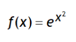
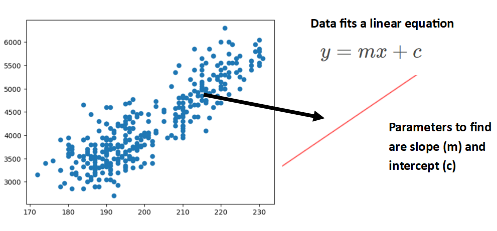
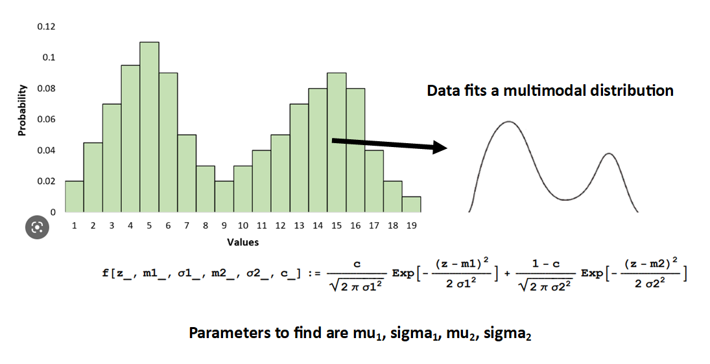
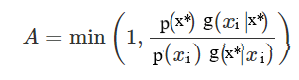
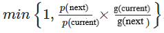

# MCMC Overview

## Definition & Background:
Markov Chain Monte Carlo (MCMC) is a class of algorithms for sampling from a known target posterior distribution by constructing a Markov Chain. The intent of the algorithm is to use sampling to get information from the distribution (e.g. expected value and random samples) that would usually need to be calculated by taking the integral of the density function. 
There exist even simple density functions where the integral cannot be determined analytically, such as

. So while evaluating f(x) for any x may be trivial, obtaining a random sample of values of f(x) or computing the expected value could be extremely difficult.

The MCMC algorithm iteratively adjusts the estimated distribution parameters to yield the best match between the observed data and proposed distribution/equation. Conceptually, we need to select from the density function in proportion to the density in specific regions — where the density peaks there should be more samples drawn than locations where the density function is negligible. The output provides a set of parameter values for the target posterior distribution, and a distribution of likely values for each parameter.

Markov Chains are uniquely defined by the Markov Property - where the probability of transitioning to a new state (the transition probability) is dependent only on the current state and not the past sequence of states. As the Markov process iterates many times, it reaches a stationary state, meaning the probability of the next state will eventually converge to equals that of a prior state. The stationary state allows you to define the probability of every state at any point in time.

## Intuition Behind Algorithm:
MCMCs "wander around" a lumpy surface (e.g. a probability density function), spending time in an area proportional to its height, and thus infers the target distribution without needing to know the exact height.

## Use Cases of MCMC:
- **Parameter Estimation** of a probability distribution or equation (e.g. estimating mu and sigma of a Normal distribution, or slope and intercept of a line)
- **Bayesian applications** where the posterior distribution is proportional to the prior times the likelihood, but the constant of proportionality is often unknown. MCMC is particularly useful for sampling from posterior distributions to perform analytically-intractible Bayesian calculations. 

## High Level Steps, in Practice:
1. Graph your data and formulate the general equation that fits the shape of the data (! finding the right equation is important to using it later to make accurate predictions). You will not know the specific parameters of the equation - you'll use MCMC to discover these.

## Metropolis Hastings Sampling Algorithm Steps:
This specific sampling algorithm is appropriate for symmetric and non-symmetric distributions, is simple to implement, and can generally be applied to a variety of high dimensional complex problems. Other possible sampling algorithms include: Gibbs Sampling, ensemble sampling, parallel tempering, adaptive MCMC, Hamiltonian Monte-Carlo, and Reversible Jump MCMC. 

### Key Terms ###
Posterior Distribution = 
Proposal Distribution = 

### _Initialization_ ###
**1. Choose Proposal Density Function (also called Proposal Distribution of Jumping Proposal)**
The Proposal Distribution is needed in order to move around parameter space & calculate the transition probabilities of moving from one point in parameter space to another. 

This density function is used to suggests candidate parameters for the next state, given the current state parameters:
x* ~ q(x* | xi),
where xi is the current state of distro parameters and x* is the next state of distro parameters

For each iteration of the algorithm, we draw a proposed parameters x*.

The Proposal Distribution allows us to move around the unknown parameter space and specify the probability of moving to point xi+1 in the parameter space given that we are currently at xi.

This is ultimately helping us determine the target posterior distribution parameters (e.g. the histogram of the MCMC samples produces the target posterior distribution)

***Ideal Proposal Distribution:***
The chain will converge to the target distribution if the transition probability is:
- irreducible: From any point in parameter space, we must be able to reach any other point in the space in a finite number of steps.
- positive recurrent: For any point in parameter space, the expected number of steps for the chain to return to that point is finite. This means that the chain must be able to re-visit previously explored areas of parameter space.
- aperiodic: The number of steps to return to a given point must not be a multiple of some value k. This means that the chain cannot get caught in cycles.

The proposal probability density function needs to be proportional to the target posterior PDF, but not necessarily connected to a choice of prior or likelihood in a Bayesian model. So using a prior distro for the proposal distro may not be the most efficient choice. Gaussian with fixed standard deviation is a very efficient proposal distribution to use.

**2. (Optional) Specify prior ranges for the parameters**
Why allow the chain to spend time exploring areas that you know are not possible?

**3. Choose arbitrary intial parameter values to begin with (inital state)**
You can choose the values or randomly generate a value for each parameter using a uniform continuous distribution.

### _Iterations_ ###
**4. Generate next parameter values (next state) by randomly sampling a value for each parameter from the Proposal Distribution you defined in Step 1**
A very simple way to generate a new position x* from a current position xi for a Normal(0,1) proposal distribution is to add a N(0,1) random number to xi -->
x* = xi + (random number from N(0,1))

**5. Determine if the next state shoud be accepted or rejected by first calculating the Acceptance Probability (also called Hastings Ratio or Acceptance Probability)**
The Hastings Ratio is defined as 

and similarly in simpler terminology

where p(⋅) and g(⋅) are probability density values. p(⋅) stands for the unknown target distribution, while g(⋅) stands for the proposal distribution.
When the proposal distibution is symmetric (e.g. Normal distribution) it follows the property of g(xi|x*) = g(x*|xi), and thus the g(⋅) ratio solves to 1. Note that assymmetric distributions like the Beta distribution do not follow this property.

The p(⋅) ratio is the density values for the next state and current state, obtained ???

a component of the targetposterior, then the Metropolis-Hastings ratio is the likelihood ratio.

- the ratio of the target posteriors ensures that the chain will gradually move to high probability regions
- the ratio of the proposal probabilities ensures that the chain is not influenced by “favored” locations in the proposal distribution function
- 

**6. Then generate a randomly generated number *u* from Uniform(0,1). If u < min(1, A.P.) then proceed with proposed parameters (also called allowing a "jump" or "advancing the chain"). If not, then stay on the current state parameters**
If _u_ <= Ratio then the jump will be accepted and the chain advances to the next state.
If _u_ > Ratio then the jump will be rejected and the chain stays at the current state.

In some cases, the density values may be very large or very small and cause a numeric overflow or an underflow. An alternative to the traditional Accept/Reject formulation is to apply logs-->
log(_u_) <= log( p(new) ) - log( p(old) ) + log( h(old) ) - log( h(new) )

**7. Posterior predictive checking: calculate log likelihood for each state**

**8. Repeat many times**

**9. Find target posterior distribution, which is proportional to the MCMC samples**

## Resources:
- https://en.wikipedia.org/wiki/Metropolis%E2%80%93Hastings_algorithm#cite_ref-9
- https://www.statsref.com/HTML/monte_carlo_markov_chains.html
- https://jellis18.github.io/post/2018-01-02-mcmc-part1/ (python)
- https://youtu.be/XRfmdP5Gavs
- https://youtu.be/yCv2N7wGDCw
- http://modernstatisticalworkflow.blogspot.com/2017/05/model-checking-with-log-posterior.html
- https://towardsdatascience.com/mcmc-intuition-for-everyone-5ae79fff22b1 (python)
- https://prappleizer.github.io/Tutorials/MetropolisHastings/MetropolisHastings_Tutorial.html (python)
- https://prappleizer.github.io/Tutorials/MCMC/MCMC_Tutorial.html (python)
- https://twiecki.io/blog/2015/11/10/mcmc-sampling/ (python)
- https://bayesball.github.io/BOOK/simulation-by-markov-chain-monte-carlo.html (R)
- https://umbertopicchini.wordpress.com/2017/12/18/tips-for-coding-a-metropolis-hastings-sampler/ (R)
