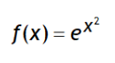
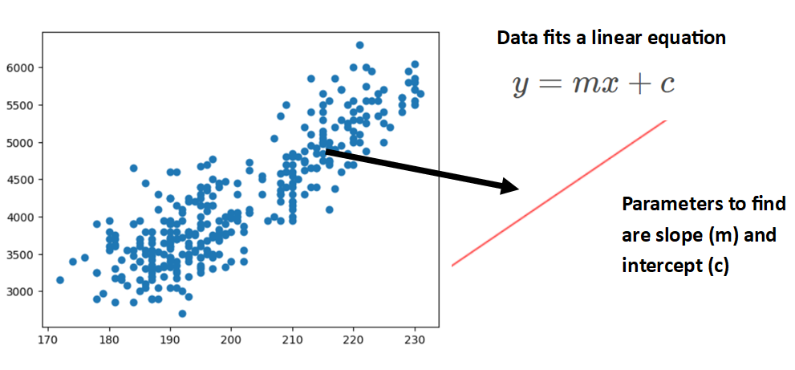
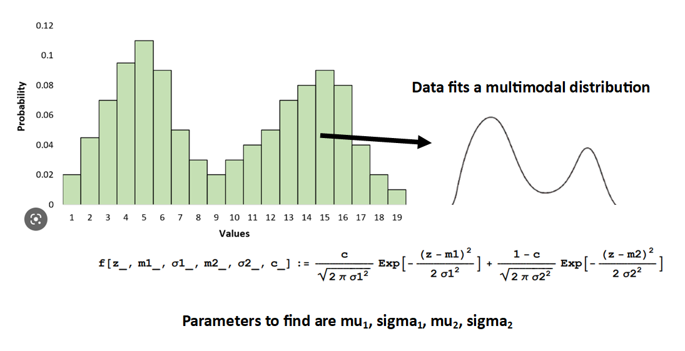
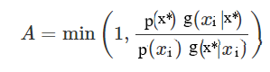
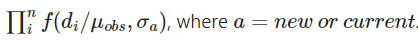
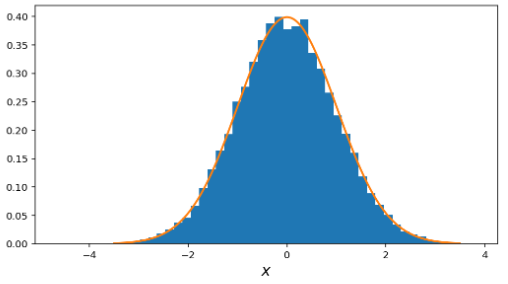
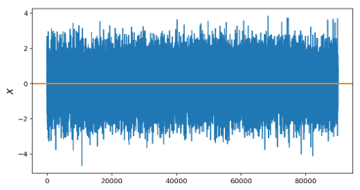
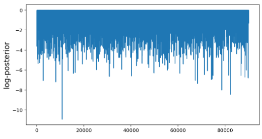
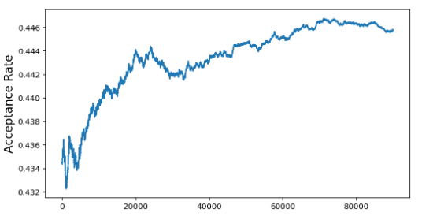

# MCMC Overview

## Definition & Background:
Markov Chain Monte Carlo (MCMC) is a class of algorithms for sampling from a known target posterior distribution by constructing a Markov Chain. The intent of the algorithm is to use sampling to get information from the distribution (e.g. expected value and random samples) that would usually need to be calculated by taking the integral of the density function. 
There exist even simple density functions where the integral cannot be determined analytically, such as

. So while evaluating this particular f(x) for any x may be trivial, obtaining a random sample of values of f(x) or computing the expected value could be extremely difficult. The MCMC approach offers a way to calculate an integral that would otherwise be impossible or difficult.

Markov Chains are uniquely defined by the Markov Property - where the probability of transitioning to a new state (the transition probability) is dependent only on the current state and not the past sequence of states. As the Markov process iterates many times, it reaches a stationary state, meaning the probability of the next state will eventually converge to equal that of a prior state. The stationary state allows you to define the probability of every state at any point in time (this is the target posterior distribution).

Conceptually, we need to select from the known density function in proportion to the density of specific regions — where the density peaks there should be more samples drawn than in locations where the density function is negligible. The output after many iterations of the algorithm are samples from the target posterior distribution. With random samples, we can derive the sampling distribution, which in turn provides the parameters of the distribution and allows us to make probabilistic inferences.

## Intuition Behind Algorithm:
MCMC algorithms "wander around" a lumpy surface (e.g. a probability density function), spending time in an area proportional to its height, and thus infers the target distribution without needing to know the exact height.

## Use Cases of MCMC:
- **Parameter Estimation** of a probability distribution or equation (e.g. estimating mu and sigma of a Normal distribution, or slope and intercept of a line)
- **Bayesian applications** where the posterior distribution is proportional to the prior times the likelihood, but the constant of proportionality is often unknown but needed for normalizing and ensuring the posterior integrates to 1. The MCMC approach is particularly useful for sampling from posterior distributions to perform analytically-intractible Bayesian calculations. 
- **Sensitivity Analysis** 

## Metropolis Hastings Sampling Algorithm Steps:
This specific sampling algorithm is appropriate for symmetric and non-symmetric distributions, is simple to implement, and can generally be applied to a variety of high dimensional complex problems. Other possible sampling algorithms include: Gibbs Sampling, ensemble sampling, parallel tempering, adaptive MCMC, Hamiltonian Monte-Carlo, and Reversible Jump MCMC. 

### Key Terms ###
**Posterior Distribution** = the target posterior distribution that you want to sample from

**Posterior Density Function** = the f(x) density function you choose that is difficult to integrate and will be used by the MCMC sampling algorithm to create the       Posterior Distribution

**Proposal Distribution** = a distribution of your choosing that is used to select the step size and direction (positive or negative) of which to navigate around the     probability density space

### _Initialization_ ###
**1. Choose Posterior Density Function**

Graph your data and formulate an f(x) density function equation that fits the shape of the data (! finding the right equation is important to using it later to make accurate predictions). You will not know the specific parameters of the equation - you'll use MCMC to discover these.

**2. Choose Proposal Distribution (also called Jumping Proposal)**

The Proposal Distribution is needed in order to move around the parameter space (e.g. mu, sigma, etc). This distribution is used to suggest candidate parameters for the next state, given the current state parameters:
x* ~ g(x* | xi),
where xi is the current state of distro parameters and x* is the next state of distro parameters

For each iteration of the algorithm, we draw proposed parameters x*. This is ultimately helping us determine the target posterior distribution parameters (e.g. the histogram of the MCMC samples produces the target posterior distribution). If you have no specific distribution in mind, choose a simple one like Normal distribution with fixed s.d. -> N(xi, sd=1). The s.d. value in this case will influence the size of the jump and is something you may need to tune to be larger or smaller (see Step #9).

***Ideal Proposal Distribution:***

The chain will converge to the target distribution if the transition probability is:
- irreducible: From any point in parameter space, we must be able to reach any other point in the space in a finite number of steps.
- positive recurrent: For any point in parameter space, the expected number of steps for the chain to return to that point is finite. This means that the chain must be able to re-visit previously explored areas of parameter space.
- aperiodic: The number of steps to return to a given point must not be a multiple of some value k. This means that the chain cannot get caught in cycles.

The proposal probability density function needs to be proportional to the target posterior PDF, but not necessarily connected to a choice of prior or likelihood in a Bayesian model. So using a prior distro for the proposal distro may not be the most efficient choice. Gaussian with fixed standard deviation is a very efficient proposal distribution to use.

**3. (Optional) Specify prior ranges for the parameters**

You might want to do this to prevent the chain spending time exploring areas that you know are not possible.

**4. Choose arbitrary intial parameter values to begin with (inital state)**

You can choose the values or randomly generate a value for each parameter using a uniform continuous distribution.

### _Iterations_ ###
**5. Generate next parameter values (next state) by randomly sampling a value for each parameter from the Proposal Distribution you defined in Step 1**

A very simple way to generate a new position x* from a current position xi for a Normal(0,1) proposal distribution is to add a N(0,1) random number to xi -->
x* = xi + (random number from N(0,1))

**6. Determine if the next state shoud be accepted or rejected by first calculating the Acceptance Probability (also called Hastings Ratio or Acceptance Probability)**

The Hastings Ratio is defined as 

and similarly in simpler terminology

where p(⋅) and g(⋅) are probability density values. p(⋅) stands for the posterior distribution, while g(⋅) stands for the proposal distribution.
When the proposal distibution is symmetric (e.g. Normal distribution) it follows the property of g(xi|x*) = g(x*|xi), and thus the g(⋅) ratio solves to 1. Note that assymmetric distributions like the Beta distribution do not follow this property.

The p(⋅) ratio is the density values for the next state and current state, obtained through the posterior density function and the observed data. The value of the predictive density at an observed point is the out-of-sample likelihood of a single datapoint. The likelihood over an entire dataset is the product of all the densities

. (Note - when finding total log likelihood, the densities are summed instead due to the properties of log). When we get the likelihoods for the next state and the current state, we can then compare those parameter values via a ratio to determine whether either lies in a higher density area of the parameter space, or lower density area based on the overall likelihood of the observed data to have come from the distribution under that set of parameter values. Remember, the MCMC approach wants to spend more time in an area proportional to its height or density.

- the ratio of the target posteriors ensures that the chain will gradually move to high probability regions
- the ratio of the proposal probabilities ensures that the chain is not influenced by “favored” locations in the proposal distribution function

**7. Then generate a randomly generated number *u* from Uniform(0,1). If u < min(1, A.P.) then proceed with proposed parameters (also called allowing a "jump" or "advancing the chain"). If not, then stay on the current state parameters**

If _u_ <= Ratio then the jump will be accepted and the chain advances to the next state.
If _u_ > Ratio then the jump will be rejected and the chain stays at the current state.

In some cases, the density values may be very large or very small and cause a numeric overflow or an underflow. An alternative to the traditional Accept/Reject formulation is to apply logs-->
log(_u_) <= log( p(new) ) - log( p(old) ) + log( g(old) ) - log( g(new) )

**8. Repeat many times**

The number of iterations is equivalent to the length of the MCMC chain. How many samples are required to reach convergence and to have sufficient precision depends on the complexity of data and model, and may range from as few as 100 to several million. I've seen recommendations to begin with 2,000 - 10,000 iterations.

The inital iterations in the MCMC algorithm are considered "burn in", meaning the period of time to before the system satisfactorily settles into its stationary distribution and is suitable for use. Usually these values are dropped from final parameter value consideration. A general recommendation would be to drop the initial 25% of the iteration values.

**9. Diagnose efficiency and convergence**

There are plots you can use to review the sampler's performance and convergence. Below is an explanation of each one with a visual example of what the ideal state might look like.
- **Histogram of samples**: In an optimally performing MCMC, the histogram of samples should converge to the posterior distribution. 

- **Trace Plot (Sample vs Iteration)**: The trace of the chain should sample around the maximum of the posterior such that the samples are close to i.i.d (independent, identical distribution)

- **log-Posterior vs Iteration**: The log-posterior chain should be smoothly varying around the maximum

- **Acceptance Probability vs Iteration**: A good acceptance rate depends on the problem but typically for 1D problems it should be around 44%, and around 23% for more than 5 parameters.

***Problems with the Sampler:***

1. The histogram of samples is very poorly reproducing the posterior; or the chain trace slowly varies around the mean or has large visual gaps; or the acceptance rate is extremely high (e.g. 99%)
- You should increase your jump proposal size.

2. The chain trace is very choppy; or the acceptance rate is extremely low (e.g. 0.3%)
- The algorithm was inefficient as spent a lot of time at fixed locations in parameter space and rarely moved. You should decrease your jump proposal size.

3. For higher parameter spaces, some of the parameters fit the posterior distribution well and others do not.
- Try different jump sizes for different parameters. Trialing different jump proposals for each parameters in high parameter spaces or complicated posterior distributions can be difficult and tedious work. Look into automating this tuning process via adaptive jump proposals.

## Resources:

- https://en.wikipedia.org/wiki/Metropolis%E2%80%93Hastings_algorithm#cite_ref-9
- https://www.statsref.com/HTML/monte_carlo_markov_chains.html
- https://jellis18.github.io/post/2018-01-02-mcmc-part1/ (python)
- https://github.com/Joseph94m/MCMC/blob/master/MCMC.ipynb (python)
- https://youtu.be/XRfmdP5Gavs
- https://youtu.be/yCv2N7wGDCw
- http://modernstatisticalworkflow.blogspot.com/2017/05/model-checking-with-log-posterior.html
- https://towardsdatascience.com/mcmc-intuition-for-everyone-5ae79fff22b1 (python)
- https://prappleizer.github.io/Tutorials/MetropolisHastings/MetropolisHastings_Tutorial.html (python)
- https://prappleizer.github.io/Tutorials/MCMC/MCMC_Tutorial.html (python)
- https://twiecki.io/blog/2015/11/10/mcmc-sampling/ (python)
- https://bayesball.github.io/BOOK/simulation-by-markov-chain-monte-carlo.html (R)
- https://umbertopicchini.wordpress.com/2017/12/18/tips-for-coding-a-metropolis-hastings-sampler/ (R)
